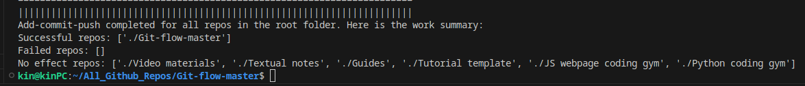

# Package: gites


Image: The photos of "gites".

While I am personally use github as a cloud drive to sync and maintain a lot of personal repos. I found the process of typing git command everyday is very repetitive. And such workflow should be streamlined into a single click. 

The goal of this package is to mimic the user experience of using a google drive or one drive. This package tries to memorize your github repo names and their link and record it into a single document, and also the commands are streamlined to be one-clicked. In such way, it save your time on synchronzing the packages when developing your projects. 

## Solutions comparison: 

Compare with `gitpython`:

| Feature / Capability            | This Package              | gitpython Library         |
|---------------------------------|---------------------------|---------------------------|
| Manage JSON file                | ✔️ Custom JSON handling   | ❌ JSON handling only     |
| Create Git repositories         | ✔️                        | ✔️                        |
| Commit changes                  | ✔️                        | ✔️                        |
| Push changes to remote          | ✔️                        | ✔️                        |
| Pull changes from remote        | ❌ (Not mentioned)        | ✔️                        |
| Sync with one click             | ✔️ Custom implementation  | ❌ (Not mentioned)        |
| Subprocess management           | ✔️                        | ❌                        |
| Pre-commit hooks                | ✔️ Custom implementation  | ❌                        |
| Custom timing functionality     | ✔️                        | ❌                        |
| Comprehensive error handling    | ✔️                        | ✔️                        |
| JSON configuration options      | ✔️ Custom implementation  | ❌                        |
| Flexibility for expansion       | ✔️                        | ✔️                        |
| Popularity and community support| ❌ (Not mentioned)        | ✔️ Well-established       |
|                                 |

Compare with `vscode source control`:


| Feature             | This Package         | VS Code Source Control |
|---------------------|----------------------|------------------------|
| JSON Management     | ✔️                    | ❌                      |
| One-Click Sync      | ✔️                    | ✔️                      |
| Git Integration     | ✔️                    | ✔️                      |
| Commit Management   | ✔️                    | ✔️                      |
| Branch Management   | ✔️                    | ✔️                      |
| Diff Viewer         | ✔️                    | ✔️                      |
| History Tracking    | ✔️                    | ✔️                      |
| Conflict Resolution| ✔️                    | ✔️                      |
| User-Friendly UI    | ✔️                    | ✔️                      |
| Customization       | ✔️                    | ✔️                      |
| Remote Repo Support | ✔️                    | ✔️                      |
| Real-time Updates   | ❌                      | ✔️                      |
| Collaboration       | ❌                      | ✔️                      |
| Performance         | Depends on Implem.   | ✔️                      |

(Note: We will add real-time update, progress tracking bar to the package in the future to make the package to be more competitive)

## Functionalities of the package: 

- JSON data store: 
    - Memorize what are the repos that you owns and their remote link. You are save it in a particular location and clone all your repos all at once with that JSON as a memory. 
>>
- Bulkclone: 
    - Users could clone a list of repos from their json file, which mimic the download actions of using a cloud storage
>>
- Bulkfetch/pull:
    - We will build it later. 
>>
- Auto-large-file-management: 
    - Very often, we might incidently include large size file in our commit, it would stucks the commit-push process. and The package would provide a set of hooks on each of your repos, which provide versatile ability of handling file size error. If there is any large size file detected, that file would be shown in the summary window.
>>
- Auto-large-file-packing-and-push: 
    - If there are large files, our package also included a functionality that providing hooks to all repos. Implementing the pre-commit hook to prevent files larger than 100MB from being committed. This feature ensures that large and unnecessary files do not clutter your repository and slow down your Git workflow.
>>
- Bulk-push: 
    - Once you have specified the root folder, that root folder can be considered as your own google drive. You can just sync all the changes with ease, by one click. 
>>


## The journey of auto-packing your repository

### Step 1 (optional): Setup the default location of the `gites-config.json` file
- `gites-config.json` would keep up all the records required to execute the gitflow commands. If you put it inside this package, as you upgrade the package, your data would lose. 
- You should locate this datastore file on another repo folder. So the datastore file would also included in the sync process. 
- If you don't do this step, the `gites-config.json` will be located in `home/pgf-package/gites-config.json`

### Step 2a (necessary): Specify the root folder location
- All the progress will be done around the root folder. This information will be stored in the json.
- You might do it this way: 

```python
abc.update_root_into('.....')
```

### Step 2b (optional): Initialize the `gites-config.json` file
- When cloning, you need to provide both the folder name, and the remote repo link for each repo.
- If you don't do that, the package will create an empty package for you in other actions if it cannot find the json in that location.
- If that is your first time using this package, you should follow these step to update your datastore json:

```python
# Testing unit: 
if __name__ == "__main__":
    
    root_directory = os.path.join(os.path.expanduser("~"), "All_Github_Repos")
    list_of_repo = {
        # "Git management": "https://github.com/pakkinlau/your-repo.git", # A repo should not clone itself. 
        "Guides": "https://github.com/pakkinlau/guides.git",
        "Textual notes": "https://github.com/pakkinlau/textual-notes.git",
        "Tutorial template": "https://github.com/pakkinlau/tutorial-template.git",
        "Video materials": "https://github.com/pakkinlau/video-materials.git",
        "JS webpage coding gym": "https://github.com/pakkinlau/js-webpage-coding-gym.git",
        "Python coding gym": "https://github.com/pakkinlau/python-coding-gym.git",
    }

    # Determine the path to the JSON file in the same directory as the script
    json_file_path = default_json_path

    # test json writing + updating
    update_repo_info(list_of_repo)
```

And the resulting json datastore would be like this:
```json
{
    "repositories": [
        {
            "name": "Guides",
            "remote_url": "https://github.com/pakkinlau/guides.git"
        },
        {
            "name": "Textual notes",
            "remote_url": "https://github.com/pakkinlau/textual-notes.git"
        },
    ],
    "root_directory": "/home/kin/All_Github_Repos"
}
```

### Step 3 (optional): Bulk clone all repos from remote
- With the datastore json, you can start clone all of your repos from remote. 
- After processing, a summary of updated/no-effect/failed repos list will be displayed.

### Step 4 (optional): Bulk fetch-pull all of your repos
- This function is still working in progress.
- With that, you can look at the updates of all repos in one-clik.
- After processing, a summary of updated/no-effect/failed repos list will be displayed.

### Step 5 (optional): Bulk push all of your repos
- The package would search all the repos in the root folder that you have specified. And try to execute commit-push for each repos.

The successful push will give you back this summary message:



## Terminal operations: 

- Installation of the package
```bash
pip install gites
```

- Ensuring your terminal has already logged in your github account:
```bash
git abcdefg
```

- Bulk push for all repos in the root folder you specified location: 
```bash
abc bulk push
```

- Setup the `gites-config.json` within terminal:
```bash
agit init
```


## Future development

1. Consider varying needs from the diversity of potential users. Adding / editing the package to provide more methods.
Such as: 
- Renaming a repo. `RenameManager()`
- Hard resolve conflicts for a repo (one-side overwrite): When remote and local is not consistent. Delete either one and then overwrite. 

2. Documentation: Use sphinx and readthedoc to produce an effective documentation to the user. Highlight, screenshot the features of the package as an image, or a video.

3. Improves the work summary message output from the package. 

## Contributing

Contributions to this repository are highly encouraged! If you have ideas for improvements, additional functionalities, or bug fixes, feel free to open an issue or submit a pull request. Let's collaborate to make Git management even more powerful and user-friendly.

## License

This repository is open-source and available under the [MIT License](LICENSE). You are welcome to use, modify, and distribute the code as per the terms of the license.

Enjoy using the Git-management package! 🚀
