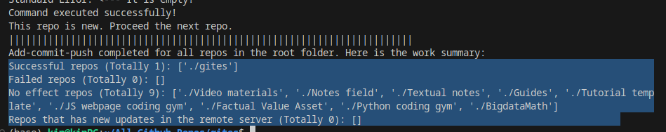
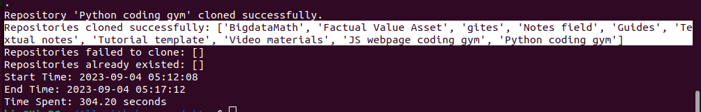
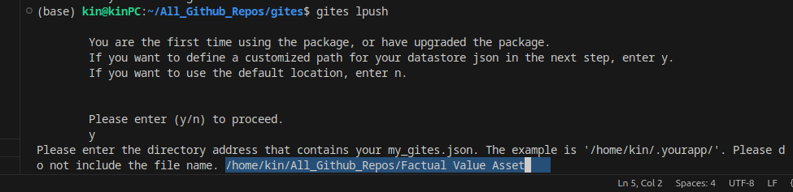
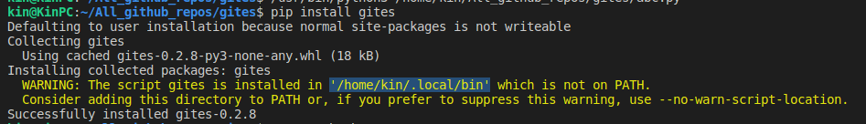

# Package: gites


Image: The photos of "gites".

I personally use GitHub as a cloud drive to sync and maintain a lot of personal repos. I found the process of typing git commands everyday to be very repetitive. So, I thought this workflow should be streamlined into a single click.

The goal of this package is to mimic the user experience of using a cloud drive like Google Drive or One Drive. This package tries to memorize your GitHub repo names, their GitHub link and record these into a single document. Git commands are streamlined to be one-clicked. This will save you time when developing and synchronizing your projects like Python packages.

## Solutions comparison:

Compare with `gitpython`:

| Feature / Capability             | This Package               | gitpython Library     |
| -------------------------------- | -------------------------- | --------------------- |
| Manage JSON file                 | ✔️ Custom JSON handling  | ❌ JSON handling only |
| Create Git repositories          | ✔️                       | ✔️                  |
| Commit changes                   | ✔️                       | ✔️                  |
| Push changes to remote           | ✔️                       | ✔️                  |
| Pull changes from remote         | ❌ (Not mentioned)         | ✔️                  |
| Sync with one click              | ✔️ Custom implementation | ❌ (Not mentioned)    |
| Subprocess management            | ✔️                       | ❌                    |
| Pre-commit hooks                 | ✔️ Custom implementation | ❌                    |
| Custom timing functionality      | ✔️                       | ❌                    |
| Comprehensive error handling     | ✔️                       | ✔️                  |
| JSON configuration options       | ✔️ Custom implementation | ❌                    |
| Flexibility for expansion        | ✔️                       | ✔️                  |
| Popularity and community support | ❌ (Not mentioned)         | ✔️ Well-established |
|                                  |                            |                       |

Compare with `vscode source control`:

| Feature             | This Package       | VS Code Source Control |
| ------------------- | ------------------ | ---------------------- |
| JSON Management     | ✔️               | ❌                     |
| One-Click Sync      | ✔️               | ✔️                   |
| Git Integration     | ✔️               | ✔️                   |
| Commit Management   | ✔️               | ✔️                   |
| Branch Management   | ✔️               | ✔️                   |
| Diff Viewer         | ✔️               | ✔️                   |
| History Tracking    | ✔️               | ✔️                   |
| Conflict Resolution | ✔️               | ✔️                   |
| User-Friendly UI    | ✔️               | ✔️                   |
| Customization       | ✔️               | ✔️                   |
| Remote Repo Support | ✔️               | ✔️                   |
| Real-time Updates   | ❌                 | ✔️                   |
| Collaboration       | ❌                 | ✔️                   |
| Performance         | Depends on Implem. | ✔️                   |

(Note: We will add real-time updates and progress tracking bars in the future to make the package to be more competitive)

---

## Functionalities of the package:

### JSON data store:

- **Remember Your Repos**: Gites allows you to effortlessly store information about the repositories you own, including their remote links, in a JSON file. This file serves as a convenient memory for your repositories.

### Auto-large-file-management:

- **Smooth Git Commits**: Gites helps you avoid the frustration of accidentally including large files in your commits, which can slow down the commit-push process.
- **Hook Integration**: Gites provides hooks for your repositories to handle large file errors. If any large files are detected, they will be highlighted in the summary window.
- **Pre-Commit Sanity**: Automatically verify or install a pre-commit hook that deals with large files in all your repositories before pushing changes.

---

## Package commands:

### `gites lpush`:

**Bulk Pushing Made Easy**: With Gites, you can quickly push changes from a local folder on your computer. Just specify the root folder, and it becomes your personal Git sync center, simplifying the synchronization process.

- Preview:
  

### `gites lclone`:

- **Bulk Cloning Convenience**: Gites offers a feature to bulk clone repositories from your JSON data store. This feature is currently in beta testing.
- Preview:
  
- `gites lfetch`(alpha):
- **Bulk Fetching Power**: Bulk fetch your repositories from a local folder on your computer. This feature is still in testing.
- `gites lpull`:
- **Bulk Pulling Ease**: Gites allows you to bulk pull repositories from your local folder. You don't need to change directory into each edited repository and pull changes one by one anymore. 

---

## The journey of using this package

### Step 1: Installation

Install Gites using pip:

```bash
pip install gites
```

- After the pip installation is completed, pip should normally add your package to your PATH automatically.

### Step 2: Organize Your Repositories

- To use gites effectively, create a dedicated folder on your local computer that will house all the repositories you wish to manage.

### Step 3: Create a my_gites.json Configuration File

- To use gites effectively, you need to create a configuration file named `my_gites.json`. This file will store information about your repositories and their locations. Follow these guidelines:
- Ensure you place my_gites.json in a folder that's regularly backed up in the cloud, such as a local GitHub repository or Google Drive folder.
- Here's a template for `my_gites.json`:

  - "repositories": List your repositories here. Include the repository name and its remote URL (e.g., GitHub URL). If you are just playing around, and not trying to bulk clone packages with gites, you can skip specifying this part.
  - "root_directory": Specify the local directory where your repositories are stored on your computer.

```javascript
{
    "repositories": [
        {
            "name": "prog-for-humanists",
            "remote_url": "https://github.com/pakkinlau/prog-for-humanists.git"
        },
        {
            "name": "Python coding gym",
            "remote_url": "https://github.com/pakkinlau/python-coding-gym.git"
        }
    ],
    "root_directories": {
        "linux": "/home/kin/All_github_repos/",
        "windows": "C:\\Users\\kinla\\Documents\\All_github_repo"
    }
}


```

### Step 4: Use any `gites` commands from the terminal

Now that you've set up gites, you can start using it to manage your repositories efficiently. Simply open your terminal and execute Gites commands.

For example, to push all repositories from your local folder, run:

```bash
gites lpush
```

The first time you install or reinstall Gites, it will prompt you to specify the location of your `my_gites.json` datastore file. You can paste the file path of the file we have made in step 2, into the terminal.



Once you've set the configuration file's location, Gites won't ask for it again.

And the command will be automatically run

## Future development

1. Consider varying needs from the diversity of potential users. Adding / editing the package to provide more methods.
   Such as:

- Renaming a repo. `RenameManager()`
- Hard resolve conflicts for a repo (one-side overwrite): When remote and local is not consistent. Delete either one and then overwrite.

2. Documentation: Use sphinx and readthedoc to produce an effective documentation to the user. Highlight, screenshot the features of the package as an image, or a video.
3. Improves the work summary message output from the package.

## Contributing

Contributions to this repository are highly encouraged! If you have ideas for improvements, additional functionalities, or bug fixes, feel free to open an issue or submit a pull request. Let's collaborate to make Git management even more powerful and user-friendly.

## License

This repository is open-source and available under the [MIT License](LICENSE). You are welcome to use, modify, and distribute the code as per the terms of the license.

Enjoy using the Git-management package! 🚀

---
## Error

(The following error should be fixed)
- If you encounter the following message, it indicates that your IDE or terminal settings are not using the default configuration:
  
- To fix it, you need to add the path showing in the PATH of your PC to make the command works in your terminal.
- Adding Gites to the PATH (for making the CLI commands of this package work)

  - Windows:
    - 1. Open your taskbar and search for "environment variables."
      2. Click on "Edit the system environment variables."
      3. In the "System Properties" window, click the "Environment Variables" button.
      4. In the "Environment Variables" window, under the "System variables" section, locate the "Path" variable and select
      5. In the "Edit Environment Variable" window, click the "New" button and add the path where pip has installed your packages.
      6. Click "OK" to close each of the open windows.
      7. Restart your terminal or command prompt for the changes to take effect.
  - Linux:
    - 1. Open your terminal.
      2. Use a text editor like nano to edit your ~/.bashrc file. To do this, run: `nano ~/.bashrc`
      3. Add the following line at the end of the ~/.bashrc file. Make sure to replace /home/kin/.local/bin with the actual path where pip installed your packages: `export PATH="$PATH:/home/kin/.local/bin"`
      4. Save the changes by pressing Ctrl + O, then press Enter. To exit the text editor, press Ctrl + X.
      5. Finally, apply the changes to your current terminal session by running:`source ~/.bashrc`
